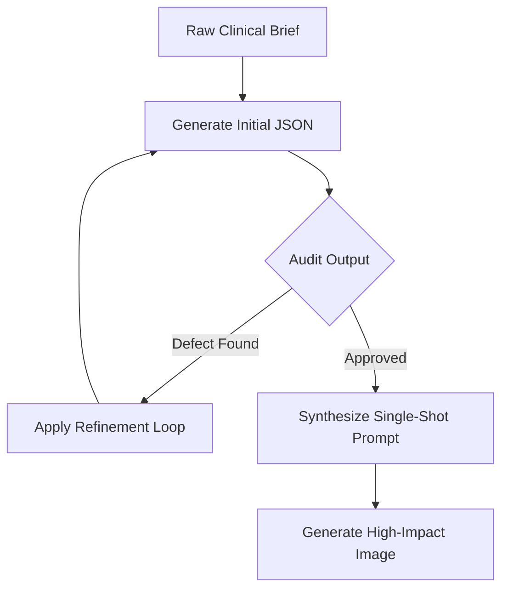

# Prompt Optimization Loop (LOOP.md)

This document outlines the systematic, iterative prompt engineering feedback loop used to audit, evaluate, and refine generated medical illustration prompts before sending them to the final image generation model (e.g. Gemini Imagen, Flux). Use this loop to programmatically or manually correct output anomalies and achieve peer-review publication quality.

---

## Phase 1: Ingestion & Initial Generation

1. **Brief Ingestion**: Input raw medical/surgical text.
2. **Schema Matching**: Generate structured output JSON using the `medicalIllustrationSchema` rules outlined in [claude.md](file:///Volumes/Macbackup/Imageprompt/claude.md).

---

## Phase 2: The Audit Checklist

Verify the generated structured JSON against these four audit pillars:

### Pillar 1: Scientific & Anatomical Accuracy
* [ ] **Anatomical Baseline**: Are normal anatomical structures correctly described with appropriate tissues and dimensions?
* [ ] **Pathophysiological Cascade**: Is the disease mechanism biologically sound and translated into concrete visual changes rather than abstract medical jargon?
* [ ] **No Placeholders**: Are there no vague descriptions like "and other cells", "etc.", or generic placeholders?

### Pillar 2: Visual Style Compliance
* [ ] **Journal Standard Alignment**:
  * For **BioRender**: Soft clinical colors, 2.5D matte plasticine surfaces, pure white solid background.
  * For **NEJM**: Watercolor-and-ink (Netter-style) detailing, H&E staining colors (purples/pinks), subtle canvas paper texture.
* [ ] **Non-Brand Tokens**: Are brand names (like "BioRender" or "NEJM") absent from the `diffusion_synthesis.master_prompt`? (They must only exist as style tags in `style_descriptors`).

### Pillar 3: Constraint Resolution
* [ ] **Zero Text Leak**: Are there absolutely no letters, text strings, labels, pointers, or numeric indicators described in the visual prompt?
* [ ] **No Graphic Overlays**: Are arrows, lines, and callout boxes deleted? (Flow must be represented through cellular density/motion gradients).
* [ ] **Word Density**: Is the `master_prompt` a single, flowing natural language description containing 180 to 260 words?

### Pillar 4: Identity Standard
* [ ] **South Asian Heritage**: If any human figures (patients, surgeons, cells with human faces) are present, is the South Asian/Indian descent explicitly defined?

---

## Phase 3: The Refinement Loop (Error Correction)

If any audit item fails, run the following refinement prompt to reconstruct the JSON:

### System Prompt for Prompt Refinement
> **Role**: Principal Medical Prompt Auditor.
> **Task**: Fix visual specification errors in the generated medical illustration JSON.
>
> **Diagnostic Feedback**:
> *[Specify the failures here, e.g., "Contains text labels", "Violates BioRender white background rule", "Missing Indian identity descriptor in master_prompt", "Master prompt too short or contains bullet points"]*
>
> **Instructions**:
> 1. Regenerate the `diffusion_synthesis` block to fix all feedback issues.
> 2. Ensure `master_prompt` remains a single, continuous, highly detailed paragraph of 180–260 words.
> 3. Enforce strict Indian/South Asian identity lock where applicable.
> 4. Ensure no text or annotations exist in any form in the visual output.

---

## Phase 4: Production Evaluation Matrix

Rate the final output from **1 to 5** before generating the final asset:

| Score | Rating | Criteria | Action |
| :--- | :--- | :--- | :--- |
| **5** | **Excellent** | Perfect anatomy, strict style alignment, zero text/labels, correct identity lock. | Proceed to Render |
| **4** | **Good** | Minor styling adjustments needed but scientifically accurate and text-free. | Optional Tweaks |
| **3** | **Fair** | Correct science, but contains minor label description leaks or styling is too generic. | Run Refinement |
| **2** | **Poor** | Scientific errors, layout is cluttered, or contains explicit requests for letters/arrows. | Re-generate |
| **1** | **Failed** | Crashed, failed schema validation, or missing the core `diffusion_synthesis` layer. | Re-generate |
